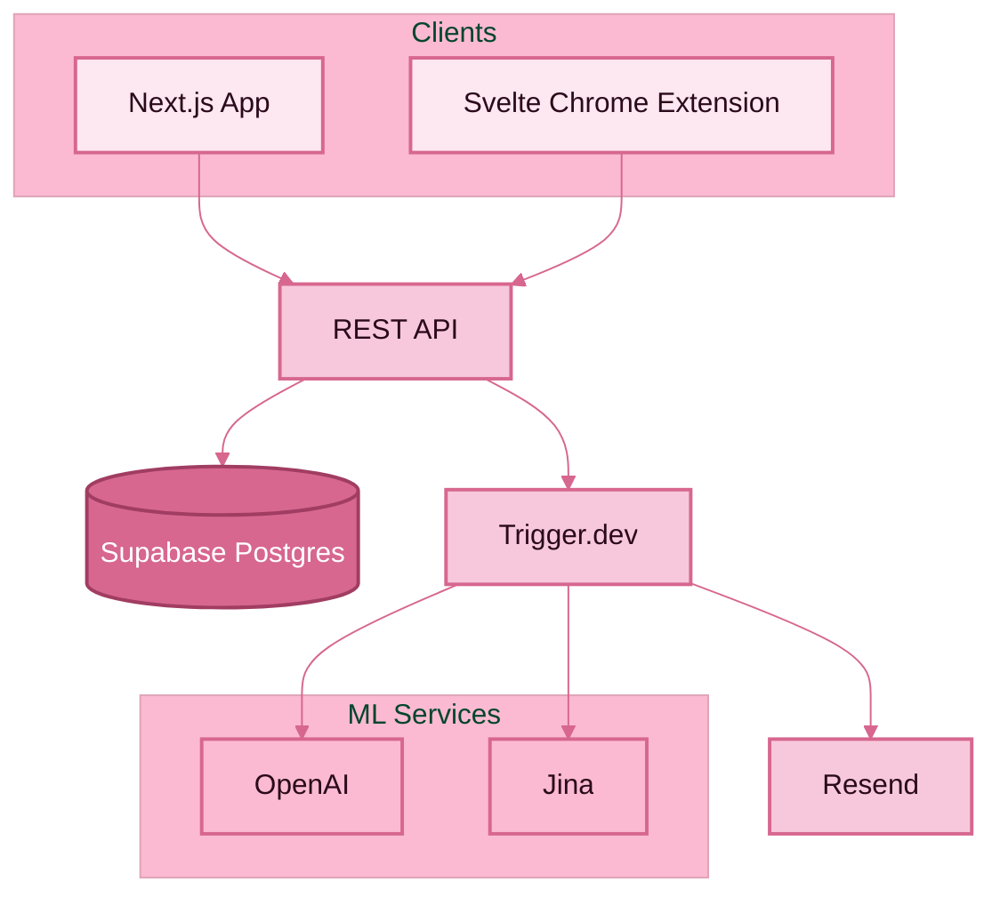

# Read It Later
- Store links, organize, and annotate
- Use LLMs to summarize
- Share links with friends

This application uses [Bun](https://bun.sh/), [Hono](https://hono.dev), [Next.js]([https://](https://nextjs.org/)).

## Getting Started
### Prerequisites
1. Install Bun:
```shell
$ curl -fsSL https://bun.sh/install | bash
```
2. Clone repo
3. Set up `.env`
  __Note: the base repo uses [Infisical](https://infisical.com/)__
4. `bun install`

### Running migrations
1. Ensure DB_URL is populated
2. `bun drizzle-kit push`

## Overall architecture
